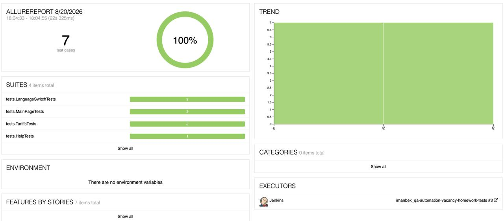
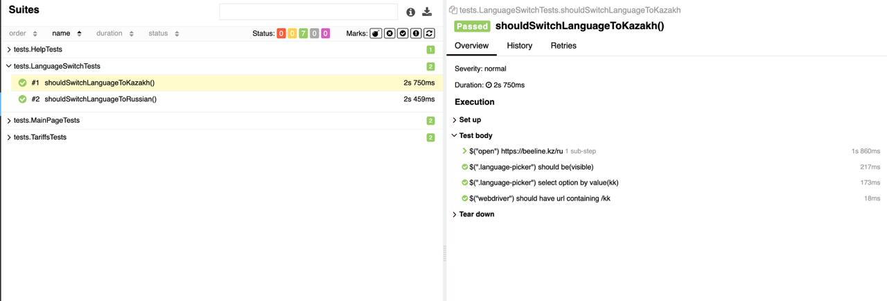

# Автоматизация UI-тестов для [beeline.kz](https://beeline.kz)

UI-автотесты для сайта оператора **Beeline Казахстан**, написанные на `Java` + `Selenide`.
Прогон выполняется в браузере на удалённом гриде `Selenoid`, результаты собираются в `Allure`
(шаги, скриншот, page source, логи консоли и видеозапись прогона).

## :pushpin: Содержание

- [Использованный стек технологий](#computer-использованный-стек-технологий)
- [Что проверяется (тест-кейсы)](#-что-проверяется-тест-кейсы)
- [Сборка в Jenkins](#-сборка-в-jenkins)
- [Результаты последнего прогона](#-результаты-последнего-прогона)
- [Запуск тестов](#arrow_forward-запуск-тестов)
- [Параметры запуска](#-параметры-запуска)
- [Allure-отчёт](#-allure-отчёт)
- [Видеозапись прогона в Selenoid](#-видеозапись-прогона-в-selenoid)
- [Структура проекта](#-структура-проекта)

## :computer: Использованный стек технологий

<p align="center">
  
  
  
  
  
  
  
</p>

- Автотесты написаны на языке `Java 17` с использованием фреймворка [Selenide](https://selenide.org/).
- Сборщик проекта — `Gradle`.
- Тест-раннер — `JUnit 5` (JUnit Jupiter).
- Браузер запускается удалённо в [Selenoid](https://aerokube.com/selenoid/).
- Отчётность — [Allure Report](https://allurereport.org/) (плагин + `aspectjWeaver` для аннотации `@Step`).
- Применён паттерн **Page Object** с fluent-методами (`return this;`).

**Содержание Allure-отчёта по каждому тесту:**
* шаги теста;
* скриншот страницы на последнем шаге;
* page source;
* логи браузерной консоли;
* видео выполнения автотеста (из Selenoid).

## 🧪 Что проверяется (тест-кейсы)

Тестируемое приложение — production-сайт `https://beeline.kz` (Nuxt/Vue SPA, локали `/ru` и `/kk`).

| # | Класс / тест | Проверка |
|---|--------------|----------|
| 1 | `MainPageTests.mainPageShouldBeOpened` | Главная открывается, `header` виден, URL содержит `beeline.kz` |
| 2 | `MainPageTests.mainPageShouldHaveCorrectTitle` | `<title>` страницы содержит «Beeline» |
| 3 | `TariffsTests.tariffsPageShouldBeOpened` | На странице тарифов виден заголовок «Тарифы для смартфона» |
| 4 | `TariffsTests.premiumFamilyTariffShouldBeDisplayed` | Отображается тариф «Премиум Семья х6» |
| 5 | `HelpTests.topQuestionsShouldBeDisplayed` | На странице помощи виден блок «Как мы можем помочь?» |
| 6 | `LanguageSwitchTests.shouldSwitchLanguageToRussian` | Переключение языка `kk → ru`, URL содержит `/ru` |
| 7 | `LanguageSwitchTests.shouldSwitchLanguageToKazakh` | Переключение языка `ru → kk`, URL содержит `/kk` |

## 🔧 Сборка в Jenkins

Автотесты запускаются на CI-сервере Jenkins; по завершении сборки публикуется Allure-отчёт.

- **Jenkins job:** [imanbek_qa-automation-vacancy-homework-tests](https://jenkins.qa.guru/job/imanbek_qa-automation-vacancy-homework-tests/)
- **Allure-отчёт (последняя сборка):** [Allure Report](https://jenkins.qa.guru/job/imanbek_qa-automation-vacancy-homework-tests/allure/)

> Ссылки выше — плейсхолдеры, замените их на реальные URL вашего Jenkins и опубликованного Allure-отчёта.

## ✅ Результаты последнего прогона

Все **7 тестов** пройдены успешно (по данным последнего локального прогона, `build/allure-results`):

| Статус | Тестов |
|--------|:------:|
| ✅ Passed | 7 |
| ❌ Failed | 0 |
| ⏭ Skipped | 0 |

<p align="center">
  
</p>

## :arrow_forward: Запуск тестов

Требуется установленный **JDK 17**.

**Удалённый запуск в Selenoid** (конфигурация по умолчанию):
```bash
./gradlew clean test
```

**Локальный запуск в своём браузере** (без грида):
```bash
./gradlew clean test -Dremote= -Dheadless=false
```

**Запуск одного класса / одного теста:**
```bash
./gradlew test --tests "tests.MainPageTests"
./gradlew test --tests "tests.MainPageTests.mainPageShouldHaveCorrectTitle"
```

> Если `JAVA_HOME` указывает не на JDK 17, задайте его явно:
> `JAVA_HOME=/Library/Java/JavaVirtualMachines/jdk-17.jdk/Contents/Home ./gradlew clean test`

## ⚙️ Параметры запуска

Параметры передаются через `-D<key>=<value>` (см. `TestBase`):

| Параметр | Назначение | По умолчанию |
|----------|------------|--------------|
| `baseUrl` | Базовый URL тестируемого приложения | `https://beeline.kz` |
| `browser` | Браузер | `chrome` |
| `browserVersion` | Версия браузера | `149.0` |
| `browserSize` | Размер окна | `1920x1080` |
| `headless` | Headless-режим | `false` |
| `remote` | URL удалённого грида (Selenoid). Пусто → локальный запуск | Selenoid (см. `TestBase`) |

## 📊 Allure-отчёт

Опубликованный отчёт последней сборки доступен в Jenkins: [Allure Report](https://jenkins.qa.guru/job/imanbek_qa-automation-vacancy-homework-tests/4/allure/)

Сгенерировать и открыть отчёт локально:
```bash
./gradlew test
allure serve build/allure-results
```

### Overview
<p align="center">
  
</p>

### Результат выполнения теста
<p align="center">
  
</p>

## 🎬 Видеозапись прогона в Selenoid


<p align="center">
  
</p>

## 🗂 Структура проекта

```
src/test/java
├── helpers
│   └── Attach.java            # вложения в Allure: скриншот, source, логи, видео
├── pages
│   ├── MainPage.java          # главная: header, заголовок
│   ├── TariffsPage.java       # тарифы: заголовок, «Премиум Семья х6»
│   ├── HelpPage.java          # помощь: «Как мы можем помочь?»
│   └── components
│       └── LanguageSwitcher.java   # переключатель языка (kk/ru)
└── tests
    ├── TestBase.java          # конфигурация Selenide/Selenoid + Allure listener
    ├── MainPageTests.java
    ├── TariffsTests.java
    ├── HelpTests.java
    └── LanguageSwitchTests.java
```
